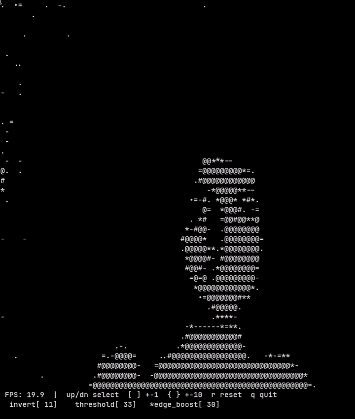

# AsciiCam
Ascii video output from your webcam in your terminal.

## TODO

- [x] Adjust width and height of capturing frame.
- [ ] Brightness/contrast adjustment.
- [ ] Custom ASCII charset via config file
- [ ] Reverse video - Invert brightness $\rightarrow$ charset mapping
- [ ] Color output - Extract U/V channels, map to ANSI/RGB codes
- [ ] Add feature to record and save it in popular video formats like `.mp4`, `.mov` and `.gif`.
- [ ] Dithering
- [ ] Migrate from C to Cpp.
