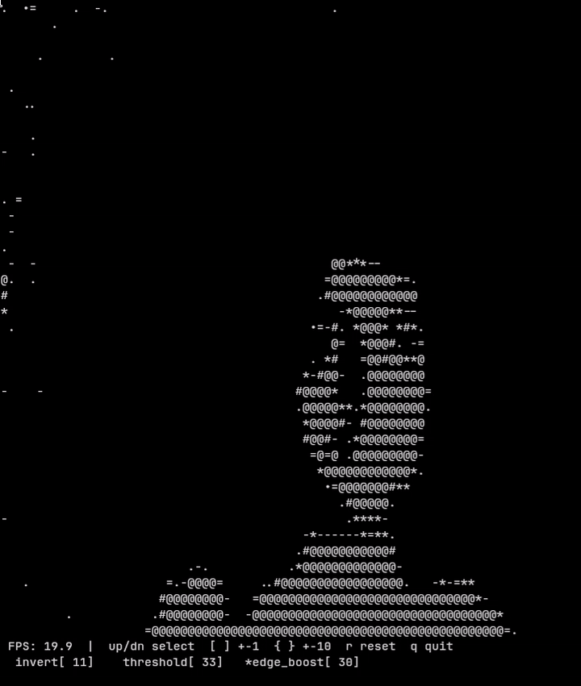
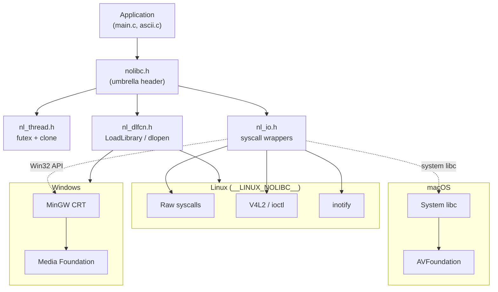

# AsciiCam
[](https://github.com/Harshit-Dhanwalkar/AsciiCam/actions/workflows/ci.yml)

Real-time webcam video rendered as ASCII art directly in the terminal

Written in C99. Ships its own minimal libc layer (`nolibc`) on Linux for zero
runtime dependencies beyond `dlopen`. Uses platform-native capture backends:
V4L2 on Linux, AVFoundation on macOS, Media Foundation on Windows.

<p align="center">
  
  
</p>

---

## Features

| Feature                       | Details                                                                                                                            |
| ----------------------------- | ---------------------------------------------------------------------------------------------------------------------------------- |
| **YUYV to grayscale**         | SSE2 SIMD (`yuyv_to_gray_simd`) - 16 pixels per iteration on x86_64, NEON on ARM64                                                 |
| **YUYV to RGB**               | Fixed‑point BT.601 conversion for truecolor output                                                                                 |
| **Render modes**              | Braille, Blocks, ASCII ramp, Half-block, Dots - cycle live with `m`/`M`                                                            |
| **Edge detection**            | Sobel, Sobel with direction, Laplacian - toggle with `x`/`X`                                                                       |
| **Image adjustments**         | Brightness, contrast, gamma (`-g 10..400`), invert mapping                                                                         |
| **Pseudo-3D depth pop**       | Parallax displacement based on brightness — `+`/`-`/`v`                                                                            |
| **Pseudo‑3D depth pop**       | Parallax effect based on brightness - adjust with `+`/`-`/`v`                                                                      |
| **Floyd‑Steinberg dither**    | Error‑diffusion to reduce banding                                                                                                  |
| **ANSI color**                | Truecolor (`-C`) or xterm-256 (`-2`) per-cell foreground                                                                           |
| **ANSI truecolor**            | `\033[38;2;R;G;Bm` per‑cell coloring                                                                                               |
| **Hot‑reloadable charsets**   | Load `.txt` ramps from a directory, switch with `n`/`N`, monitor with inotify                                                      |
| **Hot‑reload plugin system**  | `inotify` + `dlopen` - rebuild a filter `.so`, it reloads live                                                                     |
| **SIGWINCH auto-resize**      | Terminal resize re-queries `TIOCGWINSZ` and reallocates buffers                                                                    |
| **FPS‑capped render loop**    | `CLOCK_MONOTONIC` + `nanosleep` frame pacing                                                                                       |
| **Producer/consumer threads** | Double‑buffered capture + render (stubbed in main loop, active in `thread_sharing.c`)                                              |
| **Hardware camera controls**  | V4L2 exposure, contrast, white-balance via `ioctl` - live keys `e`/`E`, `c`/`C`, `w`/`W` (Linux only; macOS/Windows display `n/a`) |
| **Cross-platform**            | Linux (V4L2, nolibc), macOS (AVFoundation, system libc), Windows (Media Foundation, MinGW)                                         |

- Linux: requires `gcc`, `linux/videodev2.h` (kernel headers), `libdl`, `libpthread`.
- macOS: requires `Clang` and `AVFoundation` frameworks (linked automatically).
- Windows: requires `MinGW-w64`; links `mfplat`, `mf`, `mfreadwrite`, `mfuuid`, `ole32` (Media Foundation).

## Architecture


```mermaid
flowchart TD
    APP["Application\n(main.c, ascii.c)"]

    NOLIBC["nolibc.h\n(umbrella header)"]
    THREADS["nl_thread.h\nfutex + clone"]
    IO["nl_io.h\nsyscall wrappers"]
    DLFCN["nl_dlfcn.h\nLoadLibrary / dlopen"]

    subgraph LINUX["Linux (__LINUX_NOLIBC__)"]
        SYSCALL["Raw syscalls"]
        V4L2["V4L2 / ioctl"]
        INOTIFY["inotify"]
    end

    subgraph MAC["macOS"]
        MACLIBC["System libc"]
        AVF["AVFoundation"]
    end

    subgraph WIN["Windows"]
        CRT["MinGW CRT"]
        MF["Media Foundation"]
    end

    APP --> NOLIBC
    NOLIBC --> THREADS
    NOLIBC --> IO
    NOLIBC --> DLFCN

    IO --> SYSCALL
    IO --> V4L2
    IO --> INOTIFY
    IO -. "system libc" .-> MACLIBC
    IO -. "Win32 API" .-> CRT

    MACLIBC --> AVF
    CRT --> MF

    DLFCN --> LINUX
    DLFCN --> WIN
```

On Linux, the application makes raw `syscall(2)` invocations instead of
calling into glibc. Threading (when enabled) uses `clone()` + `futex(2)`
directly - no `libpthread`. Dynamic loading is the only remaining glibc
dependency, and it is scheduled for replacement by a minimal ELF loader
(see [TODO]).

---

## Build

```bash
git clone https://github.com/Harshit-Dhanwalkar/AsciiCam.git
```

or via ssh

```bash
git clone git@github.com:Harshit-Dhanwalkar/AsciiCam.git
```

### Linux / macOS

Navigate in `C` directory and build

```bash
cd AsciiCam/C/
make
```

### Windows (MinGW-w64)

From a Git Bash prompt with MinGW-w64 on `PATH`:

```bash
cd AsciiCam/C
make CC=gcc
```

This produces build/webcam_ascii (.exe on Windows) and compiles any
plugins in filters/ into build/\*.{so,dylib,dll}.

### Requirements:

- Linux: `gcc`, kernel headers (`linux/videodev2.h`), `libdl`
- macOS: `clang`, AVFoundation (linked automatically)
- Windows: MinGW-w64; links `mfplat`, `mf`, `mfreadwrite`, `mfuuid`, `ole32`

## Run

Run is via `make run`, which builds first and then launches the binary.
Pass arguments through the `ARGS` variable:

```bash
# Basic (grayscale, 80x40, /dev/video0)
make run

# Truecolor output
make run ARGS="-C"

# Braille rendering at 30 fps
make run ARGS="-C -m braille -f 30"

# With all three plugins
make run ARGS="-p build/invert.so -p build/threshold.so -p build/edge_detect.so"

# Edge detection mode, custom resolution
make run ARGS="-E sobel -w 320 -h 240 -W 120 -H 50"

# Dithering + inverted charset
make run ARGS="-D -i"

# Gamma correction: 50 = darker midtones, 200 = brighter
make run ARGS="-g 200"

# 256-color output (for terminals without truecolor)
make run ARGS="-2"
```

You can also run the binary directly:

```bash
./build/webcam_ascii -C -m braille
./build/webcam_ascii -p build/invert.so -p build/edge_detect.so
./build/webcam_ascii --help
```

### Config file:

AsciiCam reads ./.asciicamrc on startup if present. Keys mirror the CLI
flags and are overridden by any flag passed on the command line.

```bash
# .asciicamrc
device = /dev/video0
capture_width = 640
capture_height = 480
fps = 30
render_mode = braille
color = 1
color_mode = 256
gamma = 150
plugin = build/invert.so
```

---

## Plugin system

Plugins are shared libraries (`.so` on Linux, `.dylib` on macOS, `.dll` on
Windows). Hot-reload is only available on Linux; the macOS and Windows
builds load plugins once at startup.

```bash
gcc -O2 -fPIC -shared -Iinclude filters/my_filter.c -o build/my_filter.so
./build/webcam_ascii -p build/my_filter.so
```

**Hot-reload:** Linux: the binary watches the `.so` with `inotify`. Recompile the plugin while the viewer is running and it reloads automatically within $\approx$100 ms.

**Runtime controls:**
| Key | Action |
|---|---|
| `m` / `M` | cycle render mode forward / backward |
| `x` / `X` | cycle edge detection mode forward / backward |
| `n` / `N` | cycle loaded charset forward / backward |
| `p` / `o` | increase / decrease depth-pop strength |
| `e` / `E` | hw exposure down / up _(V4L2, Linux only)_ |
| `w` / `W` | hw white-balance down / up _(V4L2, Linux only)_ |
| `c` / `C` | hw contrast down / up _(V4L2, Linux only)_ |
| `g` / `G` | decrease / increase gamma |
| `↑` / `↓` | select plugin |
| `[` / `]` | param &plusmn; 1 |
| `{` / `}` | param &plusmn; 10 |
| `r` | reset param to 128 |
| `q` | quit |

---

## TODO

- [ ] Reduce remaining libc/runtime dependencies
  - [ ] Eliminate `-lc`
  - [ ] Replace `pthread` with raw `futex`/`clone`
    - [x] `nl_thread.h`: futex + `clone` implementation
    - [ ] Double-buffered capture thread active in main loop
  - [ ] Replace `dlopen` with a minimal ELF loader
- [x] Adjustable capture resolution
- [ ] Producer/consumer thread split : Double-buffered capture/render architecture
- [x] Brightness / contrast / gamma adjustment
- [x] Invert brightness to charset mapping
- [x] ANSI truecolor and 256-color output
- [x] Floyd-Steinberg dithering
- [x] Sobel / Sobel-direction / Laplacian edge detection
- [x] SIMD YUYV to grayscale (SSE2)
- [x] Hot-reload plugin system
- [x] Config file (`./.asciicamrc`)
- [ ] Capture frame resizing
  - [x] Auto resize on terminal `SIGWINCH`
  - [ ] Manual resize with cursor drag
- [x] Custom charset via config file
- [x] Hardware camera controls (Linux V4L2)
- [x] macOS support
  - [ ] Color support for macOS
- [ ] Windows support (Media Foundation capture backend)
  - [x] Windows capture via Media Foundation
  - [ ] Windows console raw-mode and signal handling (`SetConsoleMode` / `SetConsoleCtrlHandler`)
  - [ ] Hardware controls via `IAMCameraControl` / `IAMVideoProcAmp` (capture works, controls stubbed)
  - [ ] macOS hardware controls via `AVCaptureDevice` exposure/white-balance APIs (capture works, controls stubbed)
- [ ] Capture frame resizing
  - [x] Auto frame resizing (depends on terminal `w` and `h`)
  - [ ] Frame resizing using cursor
- [ ] Record to `.mp4` / `.gif`
- [ ] Inter-frame delta compression
- [ ] LUT cache optimization
  - [ ] LUT cache for gamma/dither paths
- [ ] Implement an ELF loader (or statically link plugins) to eliminate `-ldl` dependency

## Fixes

- [x] [Issue #2](https://github.com/Harshit-Dhanwalkar/AsciiCam/issues/2) macOS support
  - [x] Rewrite `capture.c` for macOS port using [AVFoundation](https://developer.apple.com/library/archive/documentation/AudioVideo/Conceptual/AVFoundationPG/Articles/04_MediaCapture.html).

---

Project is under [PolyForm Noncommercial License BY-NC](LICENCE).
For commercial use contact *harshitpd1729@gmail.com*.

---
